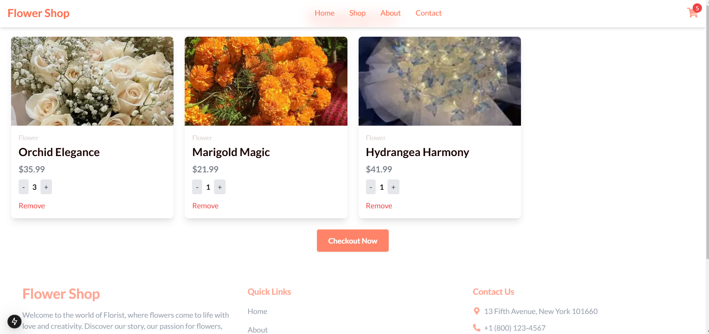
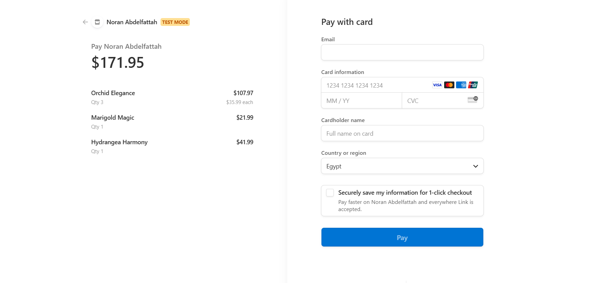

# 🛍️ My E-Commerce App

## 🚀 Overview

My E-Commerce App is a fully responsive Next.js-based e-commerce platform where users can browse products, add items to their cart, adjust quantities, and securely checkout using Stripe.

## 🎯 Features

- **Home Page**: Displays featured products and categories.
- **About Page**: Information about the store.
- **Contact Page**: Contact form using emailjs-com for user inquiries.
- **Product Page**: Shows detailed product information with quantity selection.
- **Cart System**:
  - Click the cart icon on any product to add it.
  - Updates the number of items dynamically.
  - Navigate to /cart to view selected items.
  - Increase or decrease product quantity or remove items.
- **Checkout with Stripe**:
  - Secure payments using @stripe/react-stripe-js and @stripe/stripe-js.
  - Displays Stripe payment form upon checkout.
- **Responsive Design** : Optimized for desktop and mobile using Tailwind CSS.

## 🛠️ Tech Stack

**Frontend**: Next.js (v15), React (v19)
**UI Styling**: Tailwind CSS
**Icons**: Font Awesome & React Icons
**Email Support**: EmailJS
**Payments**: Stripe integration
**TypeScript**: Strongly typed components for better scalability

## 📦 Installation & Setup

### Prerequisites:

- Node.js (v16+ recommended)
- npm or yarn

### 1️⃣Clone the Repository

```
git clone https://github.com/yourusername/my-ecommerce-app.git
cd my-ecommerce-app

```

### 2️⃣ Install Dependencies

```
npm install  # or yarn install

```

### 3️⃣ Configure Environment Variables

Create a .env.local file in the root directory and add your Stripe API keys:

### 4️⃣ Run the Development Server

```
npm run dev  # or yarn dev
```

### 5️⃣ Build for Production

```
npm run build
npm start

```

## 🛒 Usage Guide

- Browse products on the home page.
- Click a product to view details and adjust quantity.
- Add items to the cart.
- Go to /cart to update or remove items.
- Click checkout to enter payment details.
- Complete the payment using Stripe.
- Receive a confirmation email.

## 📷 Screenshots







